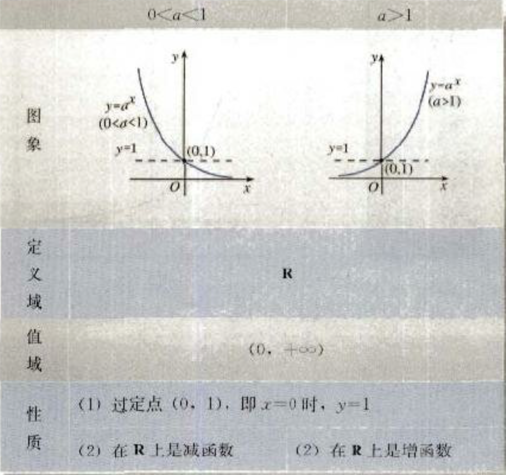
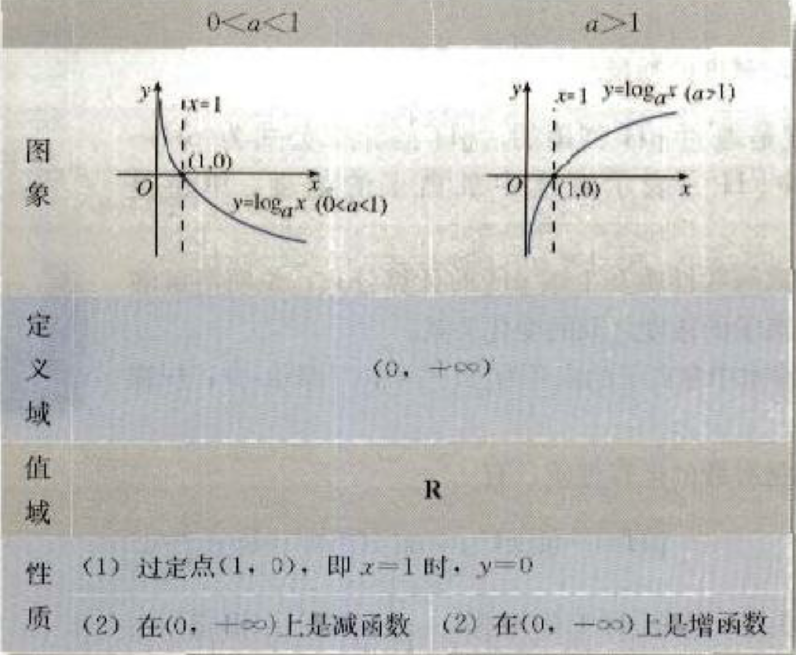

## 定义
设${A，B}$是非空的数集，如果按照某种对应关系${f}$，使对于集合A中任意一个数${x}$，在集合B中都有唯一确定的数${f(x)}$和它对应，那么就称${f:A\to B}$为集合A到集合B的一个元素。记作：${y=f(x), x\in A}$
${x}$称为自变量，其取值范围${A}$叫做函数的定义域。   
${y}$称为函数值，其取值范围称为函数的值域。

### 区间的概念
* 闭区间：满足不等式${a\le x \le b}$的实数${x}$的集合，表示为${[a,b]}$
* 开区间，满足不等式${a\lt x \lt b}$的实数${x}$的集合，表示为${(a,b)}$
* 半开半闭区间，满足不等式${a\le x \lt b}$或${a\lt x\le b}$的集合，表示为${[a,b)}$、${(a,b]}$

### 函数地表示方法
* 解析法：用数学表达式表示
* 图像法
* 列表法

## 函数的性质
### 单调性
* 减函数：对于定义域${I}$内某个区间${D}$上的任意两个自变量的值${x_1,x_2}$，当${x_1 \lt x_2}$时，都有${f(x_1)> f(x_2)}$，则称${f(x)}$在区间${D}$上是减函数。
* 增函数：对于定义域${I}$内某个区间${D}$上的任意两个自变量的值${x_1,x_2}$，当${x_1 \lt x_2}$时，都有${f(x_1)< f(x_2)}$，则称${f(x)}$在区间${D}$上是增函数。

如果${f(x)}$在区间${D}$上是增函数，或是减函数，则称${f(x)}$具有单调性,区间${D}$叫做单调区间。
### 奇偶性
* 偶函数：对于定义域内任意${x}$，都有${f(-x)=f(x)}$
* 奇函数：对于定义域内任意${x}$，都有${f(-x)=-f(x)}$

## 初等函数
### 指数函数
#### 指数和幂运算
次方根：如果${x^n=a}$，${x}$叫做${a}$的${n}$次方根。
根式：${\sqrt[n]a}$叫做根式，${n}$叫做根指数，${a}$叫做被开方数。
运算公式：
> ${a^ra^s=a^{r+s}}$ ${(a>0 , r,s \in Q)}$   
> ${(a^r)^s=a^{rs}}$ ${(a>0 , r,s \in Q)}$   
> ${(ab)^r=a^rb^s}$ ${(a>0 , b>0, r,s \in Q)}$   
> ${a^{m\over n}=\sqrt[n]{a^m}}$ ${(a>0 ; m,n \in N^+ 且n>1)}$   
> ${a^{-{m\over n}}= {1\over {a^{m\over n}}} }$ ${(a>0 ; m,n \in N^+ 且n>1)}$  

#### 指数函数及其性质
一般的，函数${y=a^x} (a>0,且a\neq 1) x\in R$ 具有以下性质

### 对数函数
#### 对数
如果 $a^x=N (a>0,且a\neq 1)$.那么$x$叫做以$a$为底，$N$的对数，记作:    
$$
    x=\log_a N
$$
其中，$a$叫做对数的底数，$N$叫做真数。    
常用对数：以10为底的对数，记作 $\lg N$   
自然对数：以$e$为底的对数，记作$In N$

运算公式: 
> 前提条件，$a>0 且a\neq 1,M>0, N>0$   
> $\log_a (M*N) = \log_a M + \log_a N$     
> $\log_a {M\over N} = \log_a M -\log_a N $   
> $\log_a {M^n}= n\log_a M (n\in R)$

#### 对数函数及性质
一般的，函数$y=\log_a x (a>0 且 a\neq 1) x\in (0,+\infty)$

