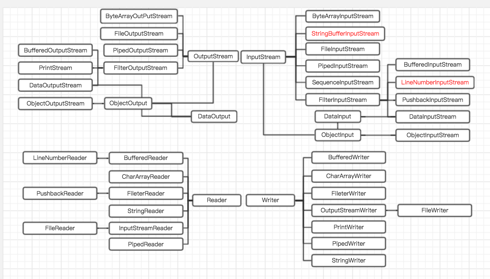

## I/O
&ensp;&ensp; I/O是input和output的简写，Java API中，可以读入字节或字符序列的对象称为输入流，可以写入字节或字符序列的对象称为输出流。其来源地和目的地可以是文件，也可以是socket、http、数组甚至是两个线程之间。   

&ensp;&ensp; I/O包下有几十个类文件，大概分为以下几种：   

* 由`InputStream`、`OutputStream`、`Reader`、`Writer`为代表的I/O类 
* 与文件系统相关的泪，例如`File`、`FileFilter`、`RandomAccessFile`等
* 序列化相关的类 
* 其他，例如工具类、异常类

## 流家族

从`InputStream`和`OutputStream`中继承的类是用来处理字节流。从`Reader`和`Writer`继承的类是用来处理Unicode字符，这些类的读写操作都是基于Unicode码元的。通过`InputStreamReader`和`OutputStreamWriter`可以将字节流转为字符流。     
      
流家族体系      
     
上图中，红色的类表示已被弃用。    

### 字节流
#### InputStream
`InputStream`有几个常用的方法 ：  
* mark : `mark`方法用于标记当前读取的位置，与`reset`方法配合使用。   
* reset : 返回`mark`标记的位置，重新从该位置读取字节
* markSupported : 是否支持mark/reset 
* available : 剩余未读取的字节数
* skip : 跳过并丢弃指定的字节数
* read : 读取字节

|类|markSupported | skip| 说明|
|:--|:-----|:------|:----|
|ByteArrayInputStream | 支持|支持|输入源，将`byte[]`作为输入源的类|
|FileInputStream | 支持|支持|输入源，将文件作为输入源的类|
|PipedInputStream| 不支持|支持|输入源，用于进程间通信，与`PipedOutputStream`配合使用|
|SequenceInputStream|不支持|支持|将多个输入源合并成一个输入源，`available`方法只返回当前输入源的`available`|

#### FilterInputStream
继承自`FilterInputStream`子类是装饰器类，它们不能自己产生字节序列，需要配合输入源才能使用，它们的主要作用是增加输入流的功能。在别的编程语言里，诸如缓冲机制和预览等细节都是自动处理的，相对而言，Java就比较麻烦，必须配合装饰器类才能实现。但是这种方式带来极大的灵活性。   

|类|markSupported | skip| 说明|
|:--|:-----|:------|:----|
|BufferedInputStream | 支持|支持|给输入流增加缓冲机制|
|PushbackInputStream | 不支持|支持|给输入流增加推回功能，即将读取的字节推回到缓冲区|
|DataInputStream| 不支持|支持|允许应用程序以与机器无关方式从底层输入流中读取基本Java 数据类型，一般与`DataOutputStream`配合使用，另外`DataInputStream`读取时采用的Java版的UTF-8编码，与标准UTF-8不同。所以`DataInputStream`读取的字节流必须时通过`DataOutputStream`写入的，不然会出问题|

#### OutputStream
`OutputStream`有几种常用的方法： 

|类| 说明|
|:--|:----|
|ByteArrayOutputStream |将输出流转化为`byte[]`|
|FileOutputStream | 文件输出流|
|PipedOutputStream |管道输出流，与`PipedOutputStream`配合使用|

#### FilterOutputStream
类似于`FilterInputStream`，`FilterOutputStream`也是装饰器类的基类。    

|类| 说明|
|:--|:----|
|BufferedOutputStream |给输出流增加缓冲机制|
|PrintStream |打印输出流 可直接输出至文件(里面封装了`FileOutputStream`) 自动刷新功能，遇到`\n`或者写入一个`byte`数组之后自动调用`flush`方法 可方便打印各种数据值表示形式 与其他输出流不同，它产生的`IOException`异常会被自身函数捕获，可以通过`checkError`检查是否发生过异常 通过`format`方法，支持格式化输出 打印的字符使用平台默认字符编码转换为字节，也可以指定编码类型 `null`值会被转为`null`字符，布尔类型会被转为`true`和`false`字符|
|DataOutputStream|允许应用程序以与机器无关方式写入基本Java数据类型，配合`DataInputStream`使用。|

#### ObjectOutput 和ObjectInput
`ObjectInputStream`和`ObjectOutputStream`用于对象的序列化，可以将任何Java类型包括对象，序列化成字节序列。    

### 字符流
#### Reader
`Reader`用于读取字符流的抽象类，使用字符流读取文件，比字节流更高效。可通过`InputStreamReader`将字节流转换为字符流。   

|类|markSupported | skip| 说明|
|:--|:-----|:------|:----|
|CharArrayReader |支持|支持|输入源，将`char[]`作为输入源的类|
|StringReader |支持|支持|输入源，将`String`作为输入源的类|
|PipedReader|不支持|支持| 类似`PipedInputStream`|
|FileReader| 不支持|支持| 类似`FileInputStream`，实际上就是在`FileInputStream`外面套了`InputStreamReader`类|
|InputStreamReader|不支持|支持|将字节流转为字符流，可以指定字符编码|
|BufferedReader |支持|支持|类似于`BufferedInputStream`，带有缓冲机制的字符流，需要提供输入源|
|PushbackReader|不支持|支持|类似`PushbackInputStream`|

#### Writer

|类| 说明|
|:--|:----|
|CharArrayWriter |将输出流转为`char[]`。`null`值被转为`null`字符串|
|StringWriter | 将输出流转为`String`。`null`值被转为`null`字符串|
|PipedWriter| 类似`PipedOutputStream`|
|PrintWriter| 类似`PrintStream`|
|OutStreamWriter|将字节流转为字符流，可以指定字符编码|
|BufferedWriter |类似于`BufferedOutputStream`，带有缓冲机制的字符流，需要提供输入源|