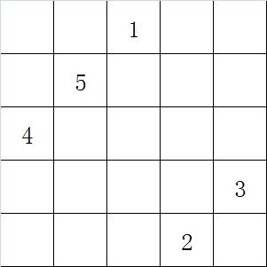
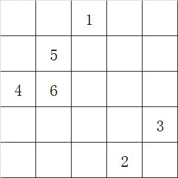
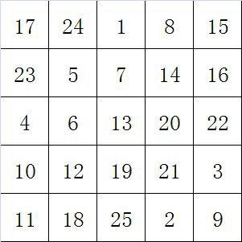
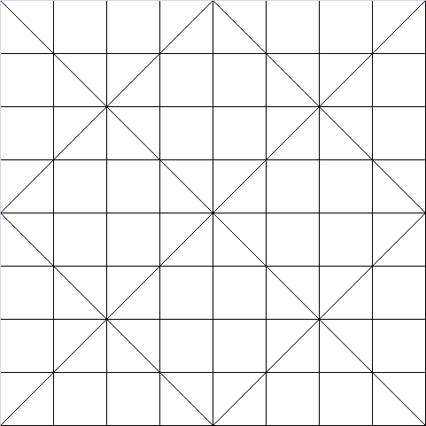
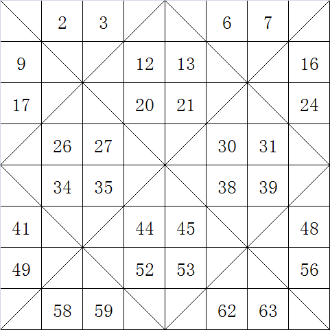
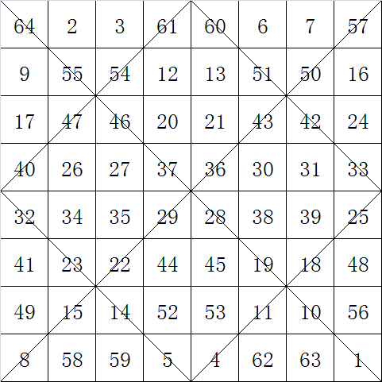
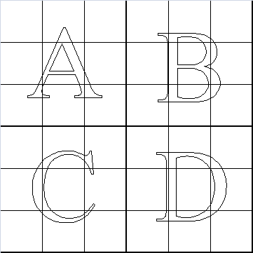
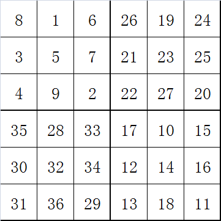
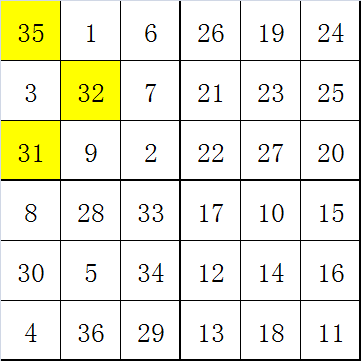
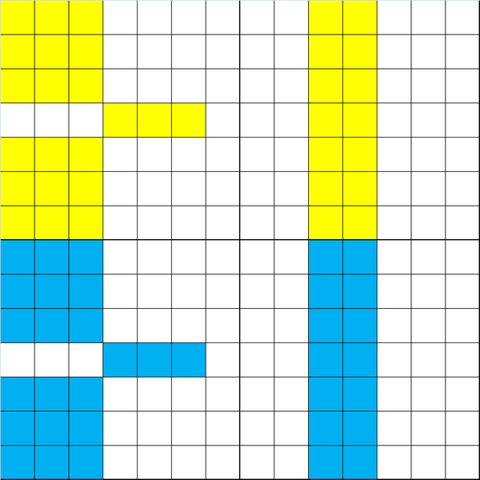

## 幻方
幻方是一种将数字安排在正方形格子中，使每行、列和对角线上的数字和都相等的方法。       
通常幻方由从$1$到$n^2$的连续整数组成。其中$n$为正方形的行或列的数目。因此$n$阶幻方有$n$行$n$列。 
幻和是幻方各行、各列、各对角线上所有数的和。幻和的公式: $$s={n(n^2+1)\over 2}$$

### 幻方的数量      

### 幻方生成方法
#### 奇数阶幻方构造法
* 把$1$放置在第一行的中间    
* 顺序将$2、3、\dots$等数放在右上方格子中。
* 当右上方格出界的时候，则由另一方进入。 
* 当右上方格中已经填有数，则把数填入正下方的方格中。
* 按照以上步骤直到填完所有$n^2$个方格。      
##### 示例
以$5$阶幻方为例      
第一行中间格填 1，从这个格子开始，向右上方按顺序填充。如果超出了第一行，则填到最底下一行；如果超出了最右边一列，则填到最左边一列
      
如果遇到下一个格子里已经有数字的，就填到当前格子的下方      
      
按照上面两条规则继续填充       

#### 4m阶幻方构造法
* 将所有格子划分为$2m\times 2m$的小幻方，给每个小幻方画上对角线。      
* 从第一行第一列开始，从左往右，从上到下，从$1$到$(4m)^2$。依次填充。规则是只填充没对角线经过的格子。
* 从最后一行最后一列开始，从右到左，从下到上，从$1$到$(4m)^2$依次填充。规则是只填充对角线经过的格子。 

##### 示例
以$8$阶幻方为例，将其分成$4$个$4\times 4$个小幻方，每个小幻方画上对角线。           
      
从第一行第一列，从左到右，从上到下，从$1$到$64$，依次填充，跳过对角线经过的格子          
      
从最后一行最后一列，从右到左，从下到上，从$1$到$64$，依次添加，跳过对角线没有经过的格子，忽略已经填过的数字      
      

#### 4m+2阶幻方构造法
* 将格子分成$4$个等大的象限。      
* 按照$A\rightarrow D\rightarrow B\rightarrow C$的顺序，把四个部分按照奇数阶幻方的顺序填充起来。      
* 从$A$象限的中间行中间列开始为第一格，往右标出$m$格。然后标出$A$象限其他行的左边$m$列。把$A$象限作出标记的格子跟$C$象限对应的格子对换。     
* 从$B$象限的中间列开始，向左标出$m-1$列，与$D$象限对换。

##### 示例
以$6$阶幻方为例。     
把格子分成$4$个等大的象限      
      
按照$A\rightarrow D\rightarrow B\rightarrow C$的顺序，把四个部分按照奇数阶幻方的顺序填充起来。        
      
标出需要互换的格子，因为$m-1=0$所以$B、D$象限不需要互换      
      

如果是$14$阶幻方，需要对换的格子如下图所示      
      
