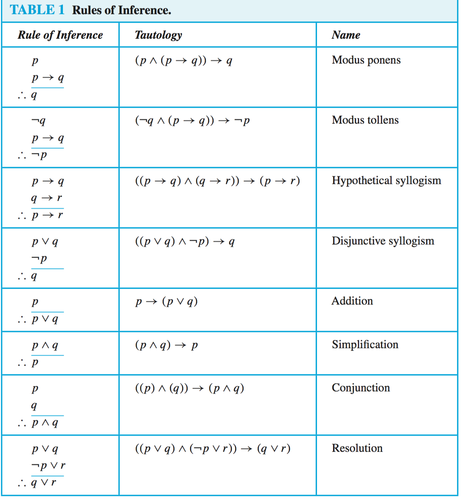
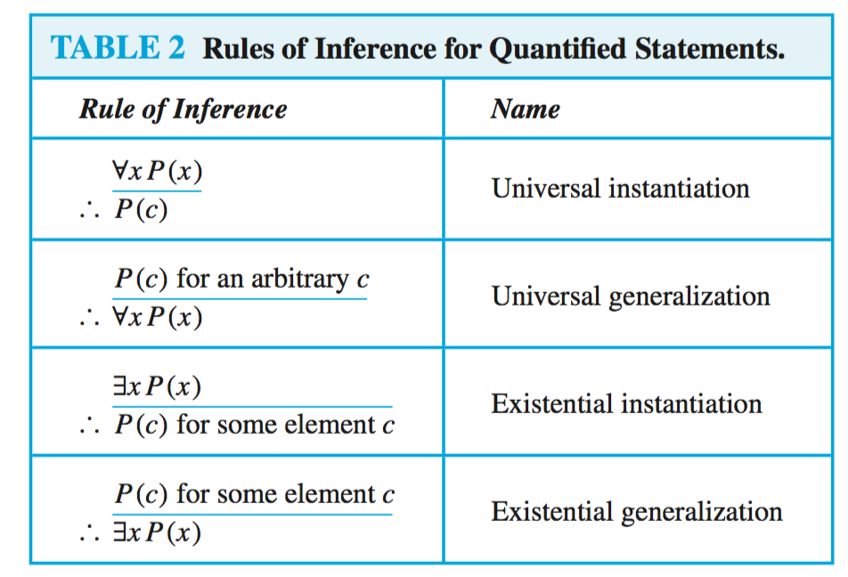

## 谓词和量词
### 谓词

我们可以讲含有变量的语句用函数表示。例如“计算机x被一个人攻击”。   
一般涉及$n$个变量$x_1,x_2,\cdots,x_n$的语句可以用$P(x_1,x_2,\cdots,x_n)$表示。形为$P(x_1,x_2,\cdots,x_n)$的语句是命题函数$P$在$n$元组$(x_1,x_2,\cdots,x_n)$的值，$P$也称为$n$元谓词。

### 量词  
* 全称量化：对于论域内的每一个$x$，$P(x)$都为真值，记作$\forall xP(x)$，其中$\forall$称为全称量词。
* 存在量化：对于论域内至少有一个$x$，使$P(x)$为真，记作$\exists xP(x)$，其中$\exists$称为存在量词。
* 唯一量词：存在惟一一个$x$使$P(x)$为真。记作$\exists!xP(x)$或$\exists_1xP(x)$。

#### 约束论域量词
* 全称量化的约束和一个条件语句的全称量化等价。例如$\forall x\lt 0(x^2 \gt 0)$等价于$\forall x(x\lt 0\rightarrow x^2 \gt 0)$ 
* 存在量化的约束和一个合取的存在量化等价。例如$\exists z\gt 0(z^2 =2)$等价于$\exists z(z\gt 0\land z^2 =2)$

#### 量词的逻辑等价
涉及谓词和量词的语句是逻辑等价的，当且仅当无论什么谓词代入这些语句，也无论用哪个个体论域于这些命题函数里的变量上，它们都有相同的真值。用符号$S\equiv T$表示涉及谓词和量词的两个语句逻辑等价。 

#### 等价关系
$$
\forall x(P(x) \land Q(x)) \equiv \forall xP(x) \land \forall xQ(x)\\
\lnot \forall xP(x) \equiv \exists x\lnot P(x) \\
\lnot \exists xQ(x) \equiv \forall x\lnot Q(x)
$$

### 嵌套量词
|语句|何时为真|何时为假|
|:-:|:-----:|:----:|
|$\forall x\forall yP(x, y)$ $\forall y\forall xP(x, y)$|对每一对$x$、$y$，$P(x, y)$均为真| 有一对$x$、$y$使$P(x ,y)$为假|
|$\forall x\exists yP(x, y)$| 对每个$x$，都有$y$使$P(x, y)$为真|有$x$，使$P(x, y)$对每个$y$总是假|
|$\exists x\forall yP(x, y)$| 有一个$x$，使$P(x, y)$对所有$y$为真|对于每一个$x$都有$y$使$P(x, y)$均为假|
|$\exists x\exists yP(x, y)$ $\exists y\exists xP(x, y)$|有一对$x$、$y$使$P(x, y$)¥为真|对每一对$x$、$y$，$P(x, y)$均为假|

## 推理规则
* 命理逻辑中的论证是一连串的命题。除了论证中最后一个命题外都叫前提，最后的命题叫结论。当所有前提为真意味着结论为真时，一个论证是有效的。
* 表示命题逻辑论证有效的关键是表示出它的论证形式有效。

### 常用的推理规则

### 带量词命题的推理规则
* 全称例示：用它从前提$\forall xP(x)$得出$P(x)$为真，其中$c$是论域里的具体成员。
* 全称生成：它说明对于论域里所有元素$c$来说$P(x)$为真的前提下，$\forall xP(x)$为真。当通过论域里拿出一个任意元素$c$并证明$P(c)$为真来证明$\forall xP(x)$为真的前提下，就使用了全称生成。
* 存在例示：在允许从已经$\exists xP(x)$为真，得出在论域里存在一个使得$P(x)$为真的元素$c$。在这里不能选择一个任意值的$c$，必须是使得$P(c)$为真的那个$c$。
* 存在生成：已知使$P(x)$为真的一个具体的$c$时，得出$\exists xP(x)$为真。

## 证明导论
* 定理：是一个能够表明为真的语句，有时把不太重要的定理称为命题。
* 引理：在其他结果证明中很有帮助的不大重要的定理
* 推论：从定理直接建立被证明的定理
* 猜想：被提出为真的命题，通常是在一些依据的基础上，启发式论证，未被证实。

### 证明定理的方法
* 直接证明
* 反证法
* 空证明：只要证明$p→q$中的$p$为假，则$p→q$为真。
* 平凡证明：只要证明$p→q$中的$q$为真，则$p→q$为真。
* 归缪证明：$¬p→(r∧¬r)$为真，则$p$为真。

### 证明的方法和策略
#### 证明的方法

* 分情形证明：为了证明形如$(p_1 ∨ p_2 ∨ \dots ∨ p_n)→q$的条件语句，可以用永真式$[(p_1 ∨ p_2 ∨ \dots ∨ p_n)→q]↔︎[(p_1 →q)∧(p_2 →q)∧\dots ∧(p_n →q)]$作为推理规则。这个推理规则说明，可以通过分别证明每个条件语句$p_i→q$来证明命题$p_1,p_2,\dots p_n$的析取式组成前提的原条件语句。
* 穷举证明：有些定理能够通过有关的小数量例子测试来证明。这些证明通过穷举所有可能进行。穷举是分情形证明的特殊类型。
* 存在性证明：对于形如$∃P(x)$的命题的证明。
    - 构造性的存在性证明：找出一个使得$P(x)$为真的元素$a$。
    - 非构造性的存在性证明：一个普通方法是，使用归缪证明，证明该存在量词化的否定式蕴含着矛盾。
* 唯一性证明：断言具有特定性质的元素惟一存在。证明分为两部分：
    - 存在性：证明存在某个元素$x$具有期望的性质
    - 唯一性：证明若$y≠x$，则$y$不具有期望的性质。或者我们可以证明如果$x$和$y$都具有期望的性质，则$x=y$。

#### 证明策略
* 前推和后推
* 改造现有证明
* 寻找反例
