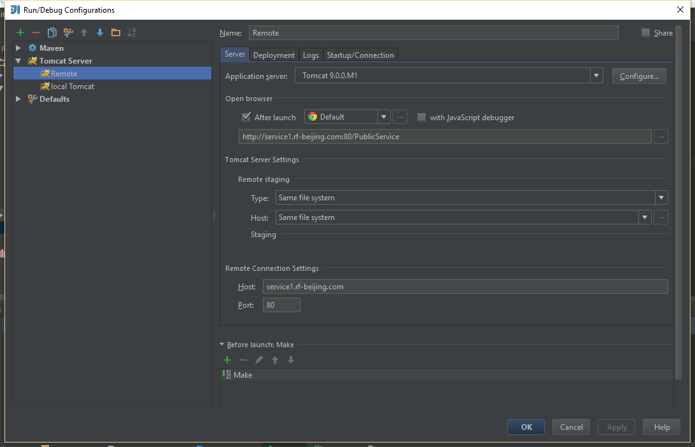
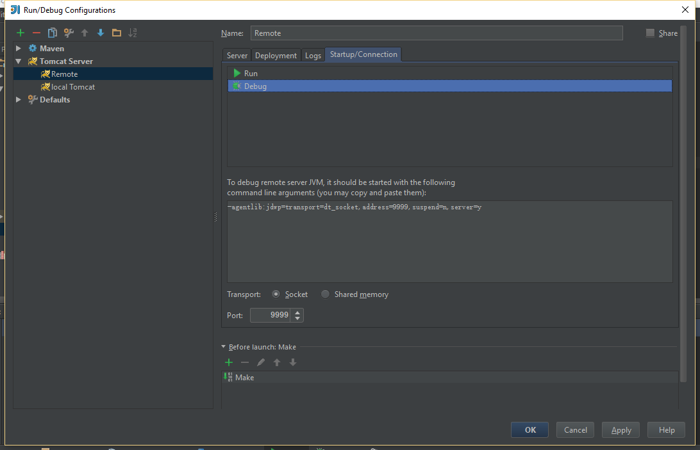

在catalina.bat文件的，最上方添加以下代码
```shell
set JAVA_OPTS=%JAVA_OPTS%  -server -Xdebug -Xnoagent -Djava.compiler=NONE -Xrunjdwp:transport=dt_socket,address=9999,server=y,suspend=n
```
- -Xdebug：启用调试特性
- -Xrunjdwp：启用JDWP实现，包含以下选项：
    - transport=dt_socket：JPDA front-end和back-end之间的传输方法。dt_socket表示使用套接字传输
    - address=9999：JVM在9999端口上监听请求
    - server=y：y表示启动的JVM是被调试者，n表示启动的JVM是调试器
    - suspend=y：y表示启动的JVM会暂停等待，直到调试器连接上（如果从tomcat一开始就进行调试，那么必须设置suspend=y
接下来再IDEA上新增一个Remote Tomcat

Host地址不用加Http
Port：为tomcat的端口

这里的port为调试端口，1中所设置的端口一直
